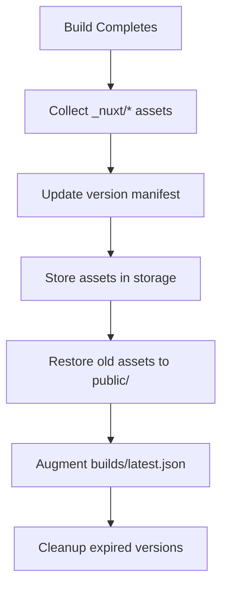
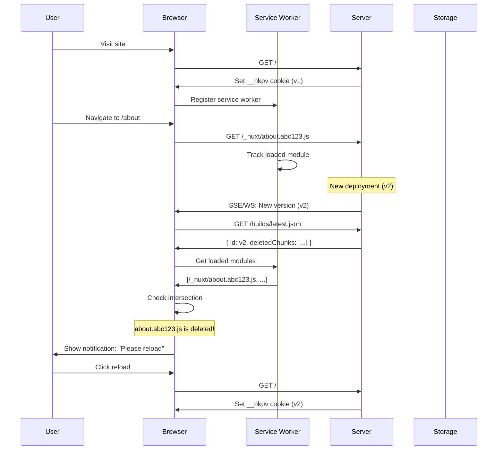

Nuxt Skew Protection eliminates version skew issues through three core mechanisms:

1. **Version Tracking** - Maintains multiple build versions to prevent 404 errors
2. **Intelligent Notifications** - Only alerts users when their loaded code becomes invalidated
3. **Real-time Updates** - Detects new deployments using polling, SSE, or WebSockets

## The Skew Problem

When you deploy a new version of your Nuxt app:

1. **Users on old sessions** continue using the previous version's JavaScript chunks
2. **These chunks may be deleted** from the server in the new deployment
3. **Navigation fails** when the app tries to load a deleted chunk (404 error)
4. **Crawlers hit 404s** when indexing old URLs from their cache

This is **version skew** - the mismatch between client and server versions.

## Solution Architecture

### 1. Build-Time Asset Management

During each build, the module:



**Key Operations:**

1. **Collect Assets** - Scans `public/_nuxt/` for all build chunks
2. **Update Manifest** - Adds current version to version history
3. **Store Assets** - Saves assets with deduplication (same hash = one copy)
4. **Restore Old Assets** - Copies previous versions back to `public/_nuxt/`
5. **Augment Metadata** - Adds version data to `builds/latest.json`
6. **Cleanup** - Removes versions older than retention policy

**Result:** Your `public/_nuxt/` folder contains assets from **multiple versions**, not just the current one.

### 2. Cookie-Based Version Tracking

The module uses a cookie (`__nkpv` - Nuxt Kit Protection Version) to track user versions:

**Server-side (on every HTML request):**

```ts
// Middleware sets cookie to current buildId
setSkewProtectionCookie(event, currentBuildId)
```

**Client-side:**

```ts
// Read cookie to know user's version
const userVersion = useSkewProtectionCookie()
const isOutdated = userVersion !== latestVersion
```

This allows:

- **Server** to know if a user is outdated
- **Client** to detect when a new version is deployed
- **Intelligent routing** based on user version

### 3. Update Detection Strategies

The module supports three strategies for detecting new deployments:

#### Polling (Default)

```ts
// Uses Nuxt's built-in mechanism
experimental.checkOutdatedBuildInterval = 3600000 // 1 hour
```

**How it works:**

- Periodically fetches `builds/latest.json`
- Compares `buildId` with current version
- Fires `app:manifest:update` hook on change

**Pros:** Works everywhere, no server code needed
**Cons:** Delayed detection (depends on polling interval)

#### SSE (Server-Sent Events)

```ts
// Real-time connection to server
const eventSource = new EventSource('/_skew/sse')
eventSource.onmessage = (event) => {
  const { buildId } = JSON.parse(event.data)
  if (buildId !== currentVersion) {
    // New version detected!
  }
}
```

**How it works:**

- Client opens persistent connection to `/_skew/sse`
- Server sends version updates in real-time
- Instant notification when new version deploys

**Pros:** Real-time, efficient
**Cons:** Only works on Node.js/Bun/Deno (not Cloudflare Workers)

#### WebSocket

```ts
// Bidirectional WebSocket connection
const ws = new WebSocket('/_skew/ws')
ws.onmessage = (event) => {
  const { type, buildId } = JSON.parse(event.data)
  // Handle version updates
}
```

**How it works:**

- Client opens WebSocket to `/_skew/ws`
- Server pushes version updates via WebSocket
- Heartbeat keeps connection alive

**Pros:** Real-time, works on Cloudflare Durable Objects
**Cons:** Requires `cloudflare-durable` preset and Durable Objects

### 4. Intelligent Module Invalidation

The key innovation: **only notify users when their loaded code is deleted**.

**Service Worker Tracking:**

```js
// sw.js intercepts all JS requests
globalThis.addEventListener('fetch', (event) => {
  if (event.request.url.includes('/_nuxt/')) {
    loadedModules.add(event.request.url)
  }
})
```

**Invalidation Detection:**

```ts
// When new version detected:
const loadedModules = await getLoadedModules() // From service worker
const { deletedChunks } = newManifest // From builds/latest.json

const invalidated = loadedModules.filter(url =>
  deletedChunks.some(chunk => url.includes(chunk))
)

if (invalidated.length > 0) {
  // User's session is broken, show notification!
  nuxtApp.hooks.callHook('skew-protection:chunks-outdated', {
    deletedChunks,
    invalidatedModules: invalidated,
    passedReleases: ['release-1', 'release-2'] // All releases that passed
  })
}
```

**Result:** Users only see notifications when they **actually need to reload**.

## Complete Flow



## Asset Deduplication

To minimize storage costs, the module deduplicates assets across versions:

**File ID Extraction:**

```ts
// Extract hash from filename
const fileId = extractFileId('entry.abc123.def456.js')
// → 'abc123'
```

**Deduplication Strategy:**

```ts
// If new build uses same hash as old version
if (fileIdToVersion[fileId] === oldVersion) {
  // Remove from old version's storage
  await storage.removeItem(`${oldVersion}/${asset}`)
  // Update mapping
  fileIdToVersion[fileId] = currentVersion
}
```

**Result:** Only one copy of each unique file stored, regardless of versions.

## Integration with Nuxt

The module integrates seamlessly with Nuxt's native mechanisms:

### builds/latest.json

```json
{
  "id": "abc123",
  "timestamp": 1234567890,
  "skewProtection": {
    "current": "abc123",
    "versions": {
      "abc123": {
        "timestamp": "2024-01-01T00:00:00Z",
        "assets": ["_nuxt/entry.abc123.js"],
        "deletedChunks": ["_nuxt/old.xyz789.js"]
      }
    }
  }
}
```

### app:manifest:update Hook

```ts
// Nuxt's built-in hook (fired by polling/SSE/WS)
nuxtApp.hooks.hook('app:manifest:update', (manifest) => {
  // Module uses this to trigger invalidation checks
})
```

### Chunk Error Handling

```ts
// Nuxt already reloads on chunk errors
// This module prevents the errors from happening
```

## Platform-Specific Behavior

The module adapts to your deployment platform:

| Platform | Update Strategy | Storage | Special Features |
|----------|----------------|---------|------------------|
| **Node.js/Bun/Deno** | SSE (default) | Filesystem | Full support |
| **Vercel** | SSE | Vercel KV | Integrates with Vercel's native skew protection |
| **Cloudflare Workers** | WebSocket | Cloudflare KV | Requires Durable Objects preset |
| **Static (Netlify, etc.)** | Polling | Filesystem | Works with SSG |

## Key Takeaways

1. **Old assets remain accessible** - Previous versions served from `public/_nuxt/`
2. **Smart notifications** - Only when user's loaded code is deleted
3. **Universal storage** - Works on any platform via unstorage
4. **Real-time or polling** - Choose based on your platform
5. **Zero config** - Works out-of-the-box with sensible defaults

Next: Learn about [Update Strategies](/docs/skew-protection/guides/update-strategies) to choose the best approach for your platform.
